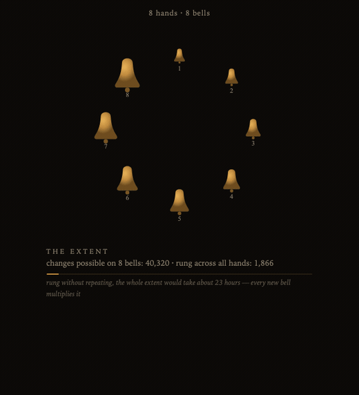

# Passing Bell

> A bell tower with no fixed place, passed from one person to one person. Each hand casts one bell. It cannot be finished alone — and every new bell moves the end further away.

**▶ Stand at the tower: <https://chrisjz.github.io/passing-bell/passing-bell.html>**



*The fifth and last piece of an anthology of five, and the only one that cannot be finished.*

---

## The two ways to pass it on

You are handed the tower, you cast your bell, and then you hand it to **one** person. There are two carriers for that handoff, and they serve different situations. The passing ritual offers both every time.

| | **The link** (light) | **The file** (deep) |
|---|---|---|
| What it is | The whole tower folded into a URL fragment: `…/passing-bell.html#pb1.…` | This page, rewritten with the tower baked inside it, downloaded as an `.html` |
| How you send it | Paste the link into a message | Send the downloaded file |
| Needs the canonical copy online? | **Yes** — the link points at the hosted page, which supplies the code | **No** — the file is the code *and* the state; it runs offline, forever |
| Size limit | Hard budget: **under 1,500 characters, always** — so it fits any text box or QR | None — carries the full state uncompressed |
| Carries the home address? | No (saves budget) | **Yes** — so a file passed around for years can still mint working links |
| Best for | The common case: one person texting one person | When the host might not outlive the lineage, or a keepsake you may never reach again |

The short version: **the link is a pointer, the file is the thing itself.** The link is lighter and travels through any channel, but it borrows the code from the web address it points at. The file needs nothing and no one — it is sovereign, and it is how the lineage survives even if this repository someday disappears.

Because the link has a hard character budget, the tower **forgets** to stay small: a ring holds twelve bells, and when a thirteenth is cast — or the rope (the fragment) fills — the oldest bell is melted into the **bourdon**, a deep bell that keeps the *count* of the melted and the date of the oldest bronze, but none of their words. That forgetting is the art, not a limitation.

---

## The statement

The other four pieces in this anthology are complete the moment you open them. The dial holds the whole history of the universe whether or not you turn it; the village moves without you, and prefers it; the model answers alone; the creature learns to believe in you, but it does the believing by itself. Each one is a sealed world.

This one is a bell tower, and a bell tower is the wrong shape for one person. Change-ringing — the English art of ringing permutations on tuned bells — cannot be practiced alone. One bell can only toll. Two can only swap. The music begins at three, and the *extent* — every change possible on N bells — is N factorial: 6 changes on three bells, 24 on four, 40,320 on eight, 479,001,600 on twelve. The only extent ever rung on eight bells took one band eighteen hours, once, in 1963. Real towers take centuries to assemble their rings, bell by donated bell, and real bells are recast from the bronze of older bells whose inscriptions did not survive the furnace.

So: a tower passed from one person to one person. Each hand casts exactly one bell and may engrave up to forty characters on its shoulder — the only thing about them that will ever travel. At generation zero the tower is empty; its founder casts the first bell, tolls it once, and completes the extent of one. **The founder is the only holder who ever finishes the piece, and they finish it alone, and it is worth almost nothing.** Every hand after that multiplies the extent — the tower's music grows richer at exactly the rate its completion recedes. The piece does not merely *need* other people; it converts each of them into a reason it can never end.

Nothing here needs care. A tower that hangs silent for a year is not dying; it is a tower, hanging silent, and when it next changes hands it will say so, to the minute, because the silence between hands is part of what it carries.

There is no server and there never will be one. The canonical copy lives on a dumb static host (GitHub Pages) that stores nothing — the fragment is never even sent to it, since URL fragments don't leave the browser. The tower exists only in transit.

## How it works (honest version)

**What the tower carries** — all of it visible in the state block, or by running `TowerCore.decodeFragment(location.hash.slice(1))` in the console:

- up to four **founder marks** (random 6-char ids minted at each genesis) — how kinship is recognized
- **gen** — every casting ever, melted included
- **rung** — changes rung across all hands, all sessions
- the **bourdon**: count of melted bells + date of the oldest melted bronze
- up to twelve **bells**: casting index, 2-char salt, cast timestamp (minute precision), a synthetic flag, and the inscription
- the **home** address — file carrier only, never spent from the fragment budget

**What is mechanically real:** every number above. Generation N is derived from generation N−1 by an actual casting with an actual clock reading; dormancy displays are subtraction between consecutive cast timestamps; the changes on screen are actual Plain Bob (even stages) and Plain Hunt (odd stages) — Plain Bob Minimus on four bells rings the true full extent, and the harness checks the rows against the printed ones. The bell voices are additively synthesized from real bell partials (hum, prime, minor-third tierce, quint, nominal), pre-rendered offline per pitch. No two towers sound alike, because the pitches follow the ring.

**What is scripted:** the prose. Every sentence the piece says ("go, Plain Bob Minor", the founder's "the tower is finished", the intro card) is a template filled with real numbers — the piece generates no language. "Changes rung" counts rows rung, including repeats of the plain course, the way real towers log performances; it is a labor count, not a coverage count, and the extent line never claims otherwise.

**What the tower cannot know, and admits:** it cannot see forks, cannot know a copy died, and cannot count hands that only listened and forwarded a link unchanged — relaying without casting is invisible by design, since nothing of that holder was consented into the state.

**When two lineages meet in one browser** (the tower keeps its latest state in `localStorage`, so this is inevitable):
- **Kin** — a shared founder mark — merge silently as a reunion: bells dedupe by identity (index + salt), counters take the maximum, so a fork meeting its own past never inflates the dead. A notice says it happened.
- **Strangers** — no shared founder — trigger an explicit choice: hang them together (bells union, counters add, overflow melts into the bourdon), or keep one and let this browser forget the other.
- The founder list caps at four (the same forgetting law); a lineage that has absorbed more than four towers will treat some true kin as kin only by the marks it still holds. Merging is honest, not omniscient.

**Consent is total.** Passing is a ritual, not a share button: engrave (or don't), then read the manifest — every bell with its words and dates, the bourdon, all counters, your bell with its exact UTC timestamp, the dormancy that timestamp will reveal, any melt your casting causes, and the home address — before anything is committed. The manifest's last line is a promise the code keeps: nothing else travels. No analytics, no fetches, no identifiers. The rung-count of your listening session travels only because the manifest showed it to you first.

## How easy forgery is

Completely easy, and you should know exactly how: the state is documented plaintext, the codec ships in the file as `window.TowerCore`, and `TowerCore.encodeFragment(anything)` will happily sign a fabricated century-old lineage — the 4-character checksum on the fragment exists to catch transit corruption and typos, not liars; it is keyed on nothing. Casual forgery is inconvenient (you must open a console and read this file), accidental corruption is loudly detected, and deliberate forgery is trivial and undetectable. An open file cannot offer cryptographic provenance, so this piece does not pretend to: the lineage is a testimony sustained by the same thing that sustains any chain letter — the unglamorous honesty of strangers. The one mark that survives every rewrite is the synthetic flag: bells cast by the harness say so, in the fragment, in the file, in the manifest, and on the bell.

## Is the download feature safe? — the security review

**Short answer: yes, it is safe to keep.** A holder can type anything into the engraving, and the file rewrites its own source, so the obvious fear is script injection — someone engraves `</script><script>evil</script>`, and a later holder who opens the file or follows the link gets owned. That cannot happen through any of the app's own input paths, and it was verified empirically, not just reasoned about.

The guarantee rests on **sanitising at every sink, never trusting the input:**

- **Into the file.** The state lives in one `<script type="application/json">` block. On rewrite, `JSON.stringify` handles quotes and backslashes, and then *every* `<` is escaped to `<`. Since no `<` can appear in the block at all, a literal `</script>` — the only way to break out of a script element — is impossible. The rewrite is also idempotent: re-run fifty times, byte-identical, still one block.
- **Into the page.** Every inscription is HTML-escaped (`escapeHtml`) before it is ever shown, so `<script>` renders as inert text. Inscriptions are also clamped: control characters stripped, whitespace collapsed, 40 codepoints / 80 encoded bytes max.
- **Into the link.** The fragment percent-encodes inscriptions and re-normalises everything on decode, so a poisoned fragment loads as a valid tower with the payload shown as text.
- **Hostile values rejected.** A `javascript:` or `data:` "home" URL is refused to `null`; a crafted `__proto__` in the state JSON does not pollute `Object.prototype`; malformed input falls back to an empty tower.
- **Defence in depth.** A strict `Content-Security-Policy` (`default-src 'none'`, no network origins, `base-uri 'none'`) means that even in the impossible event of an injection, the payload could not phone home, load a remote script, or exfiltrate anything. This is a natural fit: the piece makes **no network requests at all**, so nothing legitimate is lost. Confirmed not to break the audio engine or the download.

**[`security-test.mjs`](security-test.mjs)** drives a real browser and runs **48 assertions** covering all of the above: seven injection payloads cast through the actual ritual, the *real download button* clicked and the resulting file reopened as a victim, a poisoned fragment followed, hostile URLs and prototype pollution, and the CSP verified not to break ringing or downloading. All 48 pass.

**The one honest caveat.** A downloaded `.html` is a real web page with inline scripts. The app never *emits* executable content, but it cannot make a *hand-edited* file safe — anyone who opens a file in a text editor can add whatever they like, exactly as they could to any HTML file you're sent. So the social rule is the ordinary one: **treat a received tower file like any file from that person.** The download feature grants an attacker no capability they didn't already have (they can already write and send an HTML file); it never itself produces a dangerous one.

## The harness

```
node harness.mjs          # lineage + carrier proofs (no dependencies)
```

It extracts `TowerCore` from `passing-bell.html` exactly as shipped and proves, with ~190 assertions:

- **16 synthetic generations** pushed through actual fragment encode→decode and actual file rewrite→reparse (chained — each generation rewrites the previous generation's file), asserting state equality and the <1,500-character budget at every step, with every bell marked synthetic and the mark verified to survive both carriers;
- the 13th–16th castings melt the four oldest bells into the bourdon;
- the rewritten file still parses as the piece (both executable scripts, exactly one state block, no unescaped terminators);
- **50 consecutive rewrites**: equal state every time, byte-stable output;
- a vandalised state (hostile inscriptions, wrong types, duplicate bells, `javascript:` home) normalises to a fixed point and survives both carriers;
- worst-case rope: twelve bells of 40-codepoint emoji inscriptions fit with room to spare;
- checksum catches a single flipped character;
- kin reunion dedupes and takes maxima; stranger merger unions, sums, and melts overflow — under budget;
- Plain Bob Minimus rings 24 distinct rows and comes round; Plain Bob Minor rings its 60-row plain course; the extent on twelve is 479,001,600.

## Files

| File | What it is |
|---|---|
| [`passing-bell.html`](passing-bell.html) | The piece. One self-contained file, no dependencies, no build, no network. |
| [`index.html`](index.html) | A one-line redirect so the bare repo URL opens the tower. |
| [`harness.mjs`](harness.mjs) | The lineage + carrier proof harness (`node harness.mjs`). |
| [`security-test.mjs`](security-test.mjs) | The 48-assertion browser-driven security suite. |
| `og.png`, `ringing.gif` | Social card and the animation above. |

## Hosting

Put `passing-bell.html` anywhere static — GitHub Pages is exactly right. No build, no config: on an `http(s)` origin the tower learns its home address from where it stands and bakes it into every file it hands out. A bare link to the hosted copy is generation zero — every stranger who arrives without a fragment is offered an empty foundry and a lineage of their own.

---

*Bell inscriptions quoted in the tests ("I to the church the living call, and to the grave do summon all") are traditional. The passing bell is the bell rung for a death; this one is rung for the opposite reason, but it keeps the name, because a tower that must be handed on or end is always one hand from either.*
